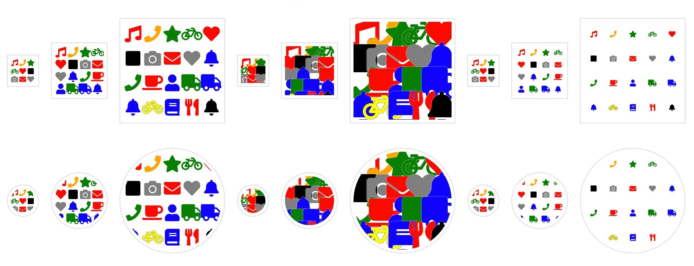
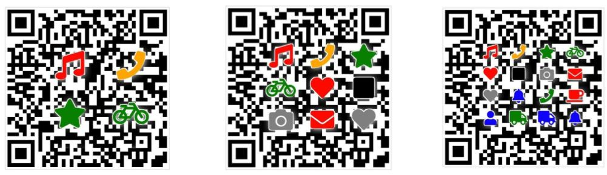

# MomCode
_Deterministic Human-friendly Visualization for Large Identifier_

Momcode takes a large identifier _(UUID, public-key, wallet address or hexadecimal hash)_ and generates a human friendly representation in visual form.  
* Distinguishable,
* Transferable,
* Memorizable,
* Simple for comparing and matching,
* Easily transmittable via a voice channel,
* and you can deterministically recover the original input string from it.

It encodes a hexadecimal string, into 'Colorful Symbols' pictographs, using 6 basic colors and a set of universally recognizable pictogram symbols such as triangles, squares, circles, stars, hearts, arrows. etc

## Progress
Momcode currently under development, for the time being you may play with the [Test Lab](/lab/), making your own Dictionary Encoding and parameter configuration proposal toward a final version to be used as standard. here is an example of use cases:

#### Hex (wallet address)
`0x88a2eff68c4077946c3be29339fd3d3bd632985b`

#### MomCode string wallet address

*Picto-art wallet address placeholder*

#### Identicon Momcode

*Picto-Art identicon placeholder*

#### QR Momcode

*Picto-Art QR-code checksumming*
